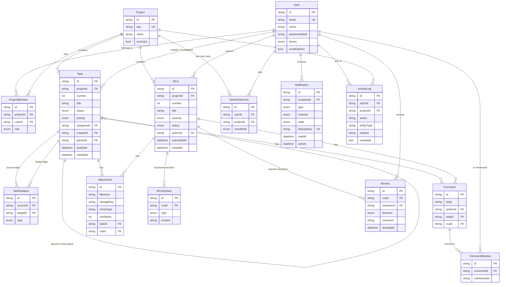

# TeamFlow — Domain Model / ERD

The data model is organised around **five primary aggregates**: Users, Projects, Tasks, RCAs, and Notifications. This document presents the entity-relationship diagram and explains the modelling decisions that matter — especially task dependencies and cross-project tracking.

> Source of truth: [`server/prisma/schema.prisma`](../server/prisma/schema.prisma). SQL lives under `server/prisma/migrations/`.

## Entity-relationship diagram



## Lifecycle rules

### Task status
```
BACKLOG → TODO → IN_PROGRESS → IN_REVIEW → DONE
   ↑        ↕         ↕            ↕          │
   └────────┴─────────┴────────────┴─── CANCELLED
DONE → IN_PROGRESS (reopen)   CANCELLED → TODO (revive)
```
Transitions are validated in `taskService.assertValidTransition`; illegal jumps are rejected. Each accepted change appends an `ActivityLog` row.

### RCA status
```
DRAFT ──submit──▶ IN_REVIEW ──all approve──▶ APPROVED (closedAt set)
  ▲                   │
  │              any reject
  └──── REJECTED ◀─────┘   (author edits & re-submits)
```
The transition out of `IN_REVIEW` is **derived** from the set of `Review` rows, not set directly — see `rcaService.deriveReviewOutcome`. It only resolves once **no review is PENDING**.

## Key modelling decisions

### 1. Task dependencies as first-class edges (`TaskRelation`)
Dependencies are modelled as a **separate directional edge entity** rather than a self-referencing column on `Task`. A `BLOCKS` edge `source → target` means *target is blocked by source*.

- **Why an edge table:** a task can have many blockers and many dependents (many-to-many), which a single FK column cannot express. An edge table also lets us store the relation `type` (`BLOCKS` vs `RELATES_TO`) and attach metadata.
- **Cycle safety:** because `BLOCKS` edges form a dependency DAG, we run a reachability check before inserting an edge and reject anything that would create a cycle.
- **Uniqueness:** `@@unique([sourceId, targetId, type])` prevents duplicate edges.

### 2. Cross-project dependency tracking
`TaskRelation` references two `Task` ids **without constraining them to the same project**. Two tasks in different projects can therefore be linked, satisfying the requirement that a task be *"tracked across more than one project."* Access control is enforced at the API layer (the caller must be a member of *both* tasks' projects to create the edge), keeping the data model flexible while authorisation stays explicit.

### 3. Sub-tasks via a self-relation
`Task.parentId → Task.id` (`TaskHierarchy`) gives a lightweight parent/child tree for breaking work down, distinct from the *dependency* graph above. Hierarchy and dependency are deliberately separate concerns.

### 4. Polymorphic comments & attachments
`Comment` and `Attachment` each carry **both** an optional `taskId` and `rcaId`, so the same collaboration primitives serve tasks and investigations from day one without duplicated tables. Application logic guarantees exactly one parent is set.

### 5. Reviews as pre-created slots
Submitting an RCA creates one `Review` row per assigned reviewer with `decision = PENDING`. Making each reviewer a **row** (unique per `(rcaId, reviewerId)`) is what lets the system know the *complete* set of required decisions — the sign-off rule ("cannot close until all reviewers decide") is a simple check that no slot is still `PENDING`.

### 6. Notifications carry a unique `dedupeKey`
The `Notification` table doubles as the **delivery log** and the **duplicate-suppression mechanism**. Writing the row *before* dispatch, with a `UNIQUE` dedupeKey, turns "don't send the same alert twice" into a database guarantee rather than application-level best-effort. `state` (`PENDING → SENT / SUPPRESSED / FAILED`) makes delivery auditable.

### 7. Append-only `ActivityLog`
Every significant state change writes an immutable log row (actor, action, entity, JSON metadata). This underpins the trustworthy project history the product stance depends on, and powers the Activity feed and audit needs without scattering history across tables.

### 8. Per-user, per-project `ViewPreference`
A dedicated table keyed `@@unique([userId, projectId])` stores whether a user prefers Kanban / calendar / list for each project, so the choice persists across sessions and devices without polluting the `Project` or `User` rows.

## Constraints summary

| Constraint | Where | Guarantees |
|------------|-------|------------|
| `User.email` unique | schema | one account per email |
| `Project.key` unique | schema | stable human-readable task keys (`TF-14`) |
| `ProjectMember (projectId,userId)` unique | schema | one role per user per project |
| `Task (projectId, number)` unique | schema | sequential per-project numbering |
| `TaskRelation (sourceId,targetId,type)` unique | schema | no duplicate edges |
| No dependency cycles | `taskService` | acyclic `BLOCKS` graph |
| `Review (rcaId,reviewerId)` unique | schema | one decision slot per reviewer |
| `RCASection (rcaId,type)` unique | schema | one of each structured section |
| `Notification.dedupeKey` unique | schema | duplicate alerts suppressed |
| Valid status transitions | `taskService` | trustworthy task history |
| RCA resolves only when all reviews decided | `rcaService` | documented sign-off |
