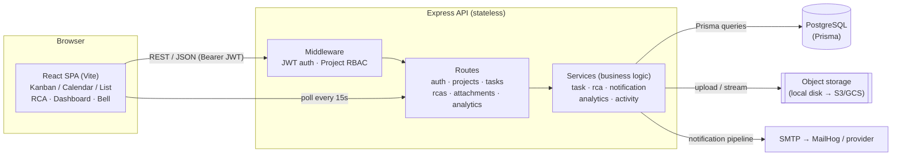
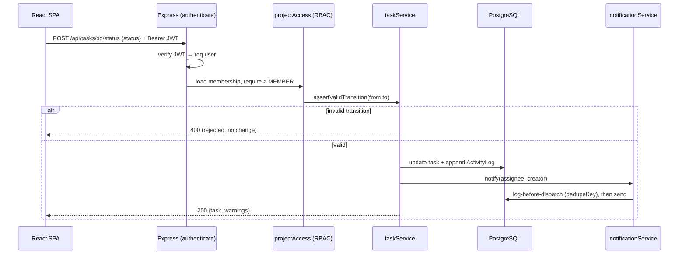
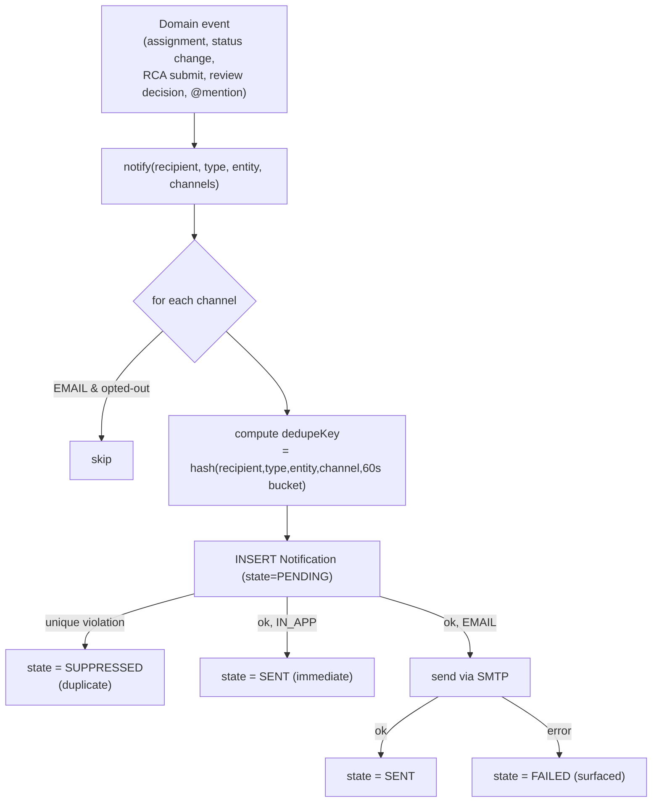

# TeamFlow — Architecture

## 1. System overview

TeamFlow is a **client–server web application**: a React single-page app talking to a stateless Express REST API backed by PostgreSQL, with an internal notification pipeline that fans out to in-app storage and email.

### Request lifecycle (example: change task status)

## 2. Architectural decisions & justification

### Monolith vs microservices → **Modular monolith**
A single deployable API with **clear internal module boundaries** (`routes/` for transport, `services/` for business logic). For a team-scale product with tightly-coupled aggregates (tasks, RCAs, notifications all reference the same users/projects), a monolith gives transactional consistency, one migration story, and trivial local setup. The service layer is already split by domain, so any hot module (e.g. notifications) can be extracted into its own service later **without rewriting callers**. Microservices now would add network hops, distributed transactions, and ops overhead we don't need at this scale.

### SQL vs NoSQL → **PostgreSQL (relational)**
The domain is **highly relational and constraint-heavy**: unique keys, foreign keys, many-to-many dependency edges, "resolve only when all reviewers decided," per-project sequential numbering. These are naturally and safely expressed with relational integrity + transactions. A document store would push this consistency into application code and make cross-entity queries (dashboards, dependency graphs) harder. Postgres also gives us JSON columns (`ActivityLog.metadata`) where we *do* want schemaless flexibility — best of both.

### Synchronous vs event-driven → **Synchronous request/response + an internal pipeline**
API calls are synchronous REST so the client gets immediate, consistent results (a task move returns the updated task and any warnings). Notifications run through an **internal pipeline abstraction** (`notificationService.notify`) that is event-shaped — one `notify()` call fans out to multiple channels and records delivery state. This gives most of the decoupling benefit (single dispatch point, dedup, per-channel outcomes) **without** standing up a broker. The `notify()` boundary is exactly where a real message queue (SQS/Rabbit) would slot in for at-least-once delivery and background retry.

### File storage → **Object-storage abstraction, local disk in dev**
Binary content is never stored in the database; `Attachment` holds a `storageKey` pointing at an object store. In development the store is the local filesystem (`uploads/`), isolated behind the attachments route. Swapping to S3/GCS means changing only that storage adapter — the schema, API, and client are unaffected. This keeps the DB small and lets file serving scale independently.

### Authentication → **Stateless JWT**
The API keeps no server-side session, so it scales horizontally with no shared session store. Tokens are signed with `JWT_SECRET` and verified per request. Trade-off: revocation is coarse (short-ish expiry) — a production build would add refresh tokens and httpOnly cookies.

## 3. Cross-cutting concerns

| Concern | Approach |
|---------|----------|
| **AuthZ** | Two-layer: `authenticate` (who you are) then `requireProjectRole` (what you may do in this project), ranked VIEWER < MEMBER < ADMIN < OWNER |
| **Validation** | Zod schemas at every write endpoint; failures return structured 400s |
| **Error handling** | Central Express error middleware maps typed `HttpError`s to responses; unknown errors → 500 |
| **Auditability** | Append-only `ActivityLog` on every significant change |
| **Consistency** | Multi-write operations (e.g. RCA submit resets + creates reviews) run in Prisma transactions |
| **Idempotent alerts** | Log-before-dispatch + unique `dedupeKey` |

## 4. Notification pipeline (detail)

The unique index on `dedupeKey` is the linchpin: even under concurrent or replayed events, the second insert fails and the alert is suppressed rather than duplicated — the exact scenario ("notification event triggered twice due to a processing lag") the product is evaluated against.

## 5. Scaling & deployment notes

- **Stateless API** → run N replicas behind a load balancer; Postgres is the only stateful tier.
- **Read scaling** → dashboard aggregations are the heaviest reads; add read replicas and/or materialised summary tables if projects grow very large (current design reads live for correctness).
- **Notifications at scale** → replace the inline pipeline with a queue + worker for background email retry and burst absorption; the `notify()` contract stays the same.
- **Files at scale** → move `UPLOAD_DIR` to S3 and serve via signed URLs / CDN.
- **Multi-region** → Postgres primary + regional read replicas; object storage replicated per region; JWTs are region-agnostic. Offline-first would layer a client cache + sync log against the same REST API.

See [`design-decisions.md`](design-decisions.md) for the alternatives considered and trade-offs behind each choice.
